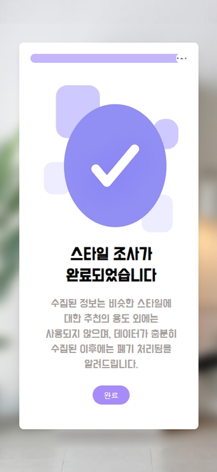
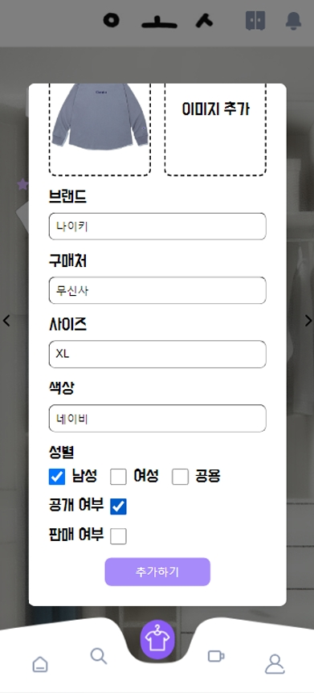
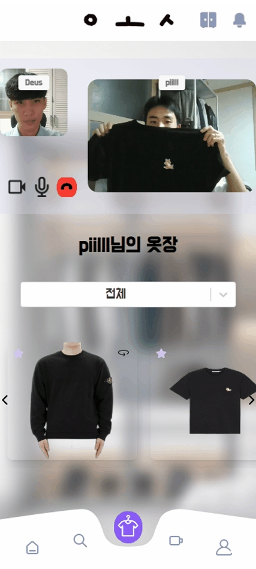
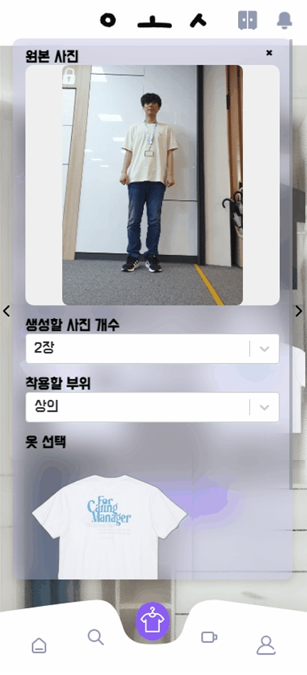

#  당신만의 온라인 옷장 ㅇㅗㅅ

## Index

#### &emsp; [➤ 프로젝트 소개](#프로젝트-소개) 

#### &emsp; [➤ 개발 환경](#개발-환경) 

#### &emsp; [➤ 기능 소개](#기능-소개) 

#### &emsp; [➤ 산출물](#산출물) 

#### &emsp; [➤ 팀 소개](#팀-소개) 

## 프로젝트 소개

**사용자만의 온라인 옷 관리 서비스**

- 직접 옷을 등록하고 조합
- 다른 사용자의 옷, 코디 추천과 AI를 통한 가상 시착
- webRTC를 통한 다른 사용자와의 중고 거래

### 프로젝트 기간

**2024.07.08 ~ 2024.08.16 (총 7주)**

## 개발 환경

- BE: SpringBoot 3.3.1, Java 17.0.12
- FE: React, TailwindCSS, Zustand, JavaScript
- AI: Python 3.9, Uvicorn 0.22.0, FastAPI 0.111, OOTDiffusion
- DB: MySQL 8.0.39
- Infra: Ubuntu 20.04, Docker, Portainer, caddy-docker-proxy
- Third Party : OAuth2.0, OpenVidu, Firebase Cloud Messaging

### 협업 관리 툴

 

## 기능 소개

### 로그인

- **로그인 화면**: 카카오,네이버,구글 소셜 로그인을 통해 로그인을 할 수 있습니다.
- **스타일 조사 화면**: 사용자 정보와 신체 정보, 선호하는 스타일에 대한 스타일 조사를 할 수 있습니다.

  
  
  
  
  

### 홈

- **추천 탭**: 스타일 조사를 통해 얻은 정보에 맞게 다른 사용자들의 추천 코디를 확인 할 수 있습니다.
- **피드 탭**: 팔로우하는 사용자들의 룩북을 확인 할 수 있습니다.
- **내룩북 탭**: 자신의 룩북을 태그로 모아 볼 수 있습니다.

  
  
  

### 옷장

- **옷장 메인 페이지**: 옷장에 옷을 등록할 수 있으며 카테고리 별로 옷을 모아볼 수 있습니다.
- **옷 상세보기**: 등록된 옷의 정보를 상세하게 확인 할 수 있습니다.

  
  
  
  
  
  

### 룩북

- **룩북 생성**: 옷장에 등록된 옷들을 조합해 직접 룩북을 만들 수 있습니다.
- **룩북 상세보기**: 조합된 코디의 옷 정보를 확인 할 수 있습니다. 댓글을 남겨 소통 할 수 있으며 댓글을 통해 중고 거래 신청이 가능합니다.

  
  
  
  
  

### webRTC

- **중고거래**: webRTC를 통해 다른 사용자와 중고거래를 할 수 있습니다.

  
  

### AI 가상 시착

- **가상시착**: AI를 통해 원하는 옷을 가상 시착해 볼 수 있습니다.

  
  
  

## 산출물

### **[Notion](https://jang-jaehun.notion.site/OTT-fabdbe1999c24fedb9a3e9baf6a364ab?pvs=4)**

### ERD

### Architecture 구조도

## 팀 소개

<table>
<thead>
<tr>
<th style="text-align: center;"><strong>박지응</strong></th>
<th style="text-align: center;"><strong>인호현</strong></th>
<th style="text-align: center;"><strong>장재훈</strong></th>
<th style="text-align: center;"><strong>전가현</strong></th>
<th style="text-align: center;"><strong>최승필</strong></th>
<th style="text-align: center;"><strong>최승현</strong></th>
</tr>
</thead>
<tbody>
<tr>
<td align="center"><a href="https://github.com/JiEung2">   @JiEung2</a></td>
<td align="center"><a href="https://github.com/inhohyun">   @inhohyun</a></td>
<td align="center"><a href="https://github.com/JaeHunJang">   @JaeHunJang</a></td>
<td align="center"><a href="https://github.com/gahyoenj">   @gahyoenj</a></td>
<td align="center"><a href="https://github.com/piilll">  @piilll</a></td>
<td align="center"><a href="https://github.com/cshyun7097">   @cshyun7097</a></td>
</tr>
<tr>
<td align="center"><b>BE</td>
<td align="center"><b>FE</td>
<td align="center"><b>BE | Infra</td>
<td align="center"><b>FE</td>
<td align="center"><b>FE</td>
<td align="center"><b>BE | 팀장</td>
</tr>
</tbody>
</table>

 
